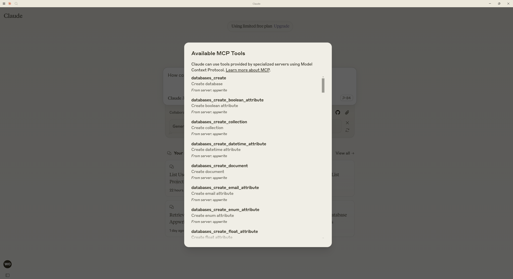

# Appwrite MCP server

## Overview

A Model Context Protocol server for interacting with Appwrite's API. This server provides tools to manage databases, users, functions, teams, and more within your Appwrite project.

Currently the server supports the following tools:

- [x] Databases
- [x] Users
- [x] Teams
- [x] Messaging
- [x] Locale
- [x] Avatars
- [x] Storage (Beta)
- [x] Functions (Beta)

> Please note that the Storage and Functions tools are currently in beta and methods like createFile and createDeployment are not yet supported.

## Local Development

Clone the repository

```bash
git clone https://github.com/appwrite/mcp.git
```

Install `uv`

```bash
curl -LsSf https://astral.sh/uv/install.sh | sh
```

Create virtual environment

```bash
uv venv
source .venv/bin/activate
```

Install dependencies

```bash
uv pip install -e .
```

Run the server

```bash
uv run -v \
  --directory ./ mcp-server-appwrite \
  --projectId YOUR_PROJECT_ID \
  --apiKey YOUR_API_KEY \
  --endpoint YOUR_ENDPOINT
```

## Configuration

### Usage with Claude Desktop

Add this to your `claude_desktop_config.json`:

```json
"mcpServers": {
  "appwrite": {
    "command": "uv",
    "args": [
      "run",
      "--directory",
      "<path-to-repository>",
      "mcp-server-appwrite",
      "--projectId",
      "YOUR_PROJECT_ID",
      "--apiKey",
      "YOUR_API_KEY"
    ]
  }
}
```

Upon successful configuration, you should be able to see the server in the list of available servers in Claude Desktop.



### Usage with [Zed](https://github.com/zed-industries/zed)

Add to your Zed settings.json:

```json
"context_servers": {
  "appwrite": {
    "command": "uv",
    "args": [
      "run",
      "--directory",
      "<path-to-repository>",
      "mcp-server-appwrite",
      "--projectId",
      "YOUR_PROJECT_ID",
      "--apiKey",
      "YOUR_API_KEY"
    ]
  }
}
```

## Debugging

You can use the MCP inspector to debug the server. For `uvx` installations:

```bash
npx @modelcontextprotocol/inspector \
  uv \
  run mcp-server-appwrite \
  --projectId YOUR_PROJECT_ID \
  --apiKey YOUR_API_KEY \
  --endpoint YOUR_ENDPOINT
```

Or if you've installed the package in a specific directory or are developing on it:

```bash
npx @modelcontextprotocol/inspector \
  uv \
  --directory . \
  run mcp-server-appwrite \
  --projectId YOUR_PROJECT_ID \
  --apiKey YOUR_API_KEY
```

## License

This MCP server is licensed under the MIT License. This means you are free to use, modify, and distribute the software, subject to the terms and conditions of the MIT License. For more details, please see the LICENSE file in the project repository.
